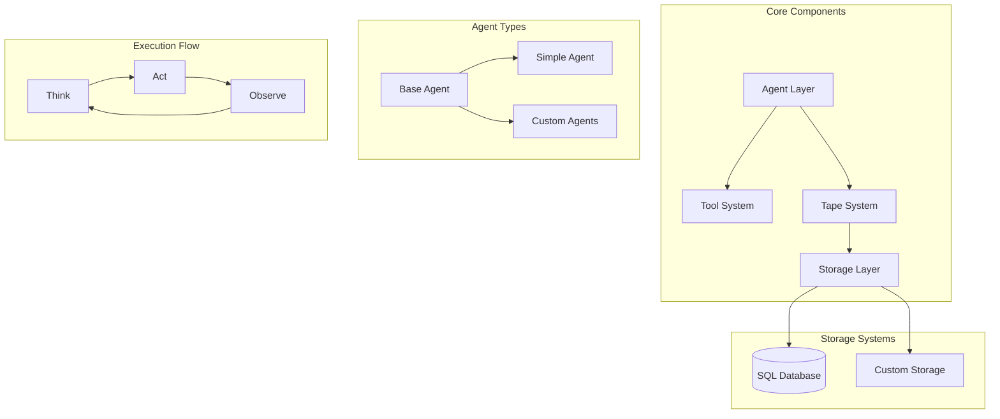
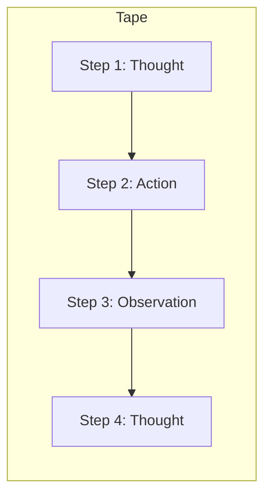
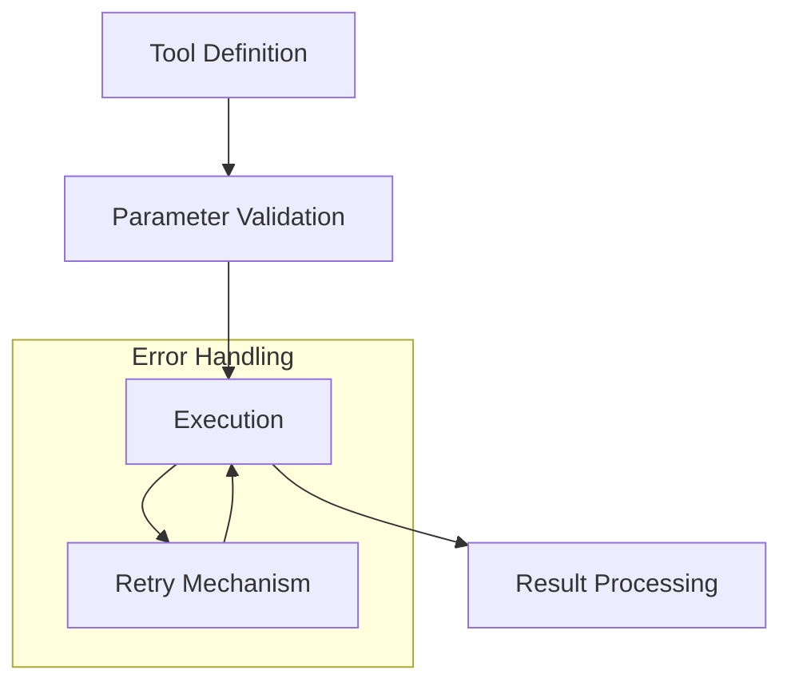
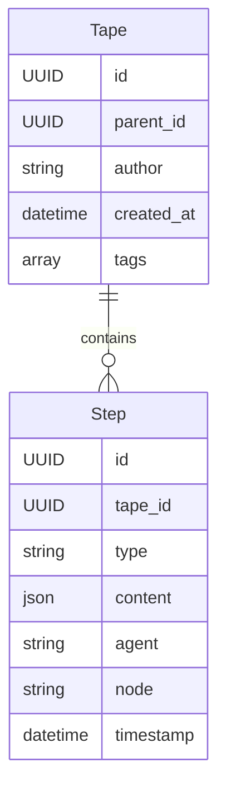
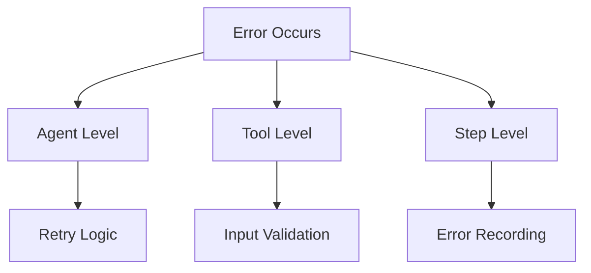

# Lightweight Agent Framework Documentation

## Overview

The Lightweight Agent Framework is a minimalist, extensible system for building autonomous agents. It provides a flexible architecture for creating agents that can think, act, and observe within a structured environment.

## Architecture



## Core Components

### 1. Agent System

The agent system is built around the `BaseAgent` abstract class, which defines the core functionality:

- **Think**: Generate thoughts based on context
- **Act**: Execute actions based on thoughts
- **Observe**: Process results of actions

```python
class BaseAgent(ABC):
    async def think(self, context: Dict[str, Any]) -> StepResult:
        """Generate a thought step."""
        pass

    async def act(self, thought: Step) -> StepResult:
        """Generate an action based on a thought."""
        pass

    async def observe(self, action: Step) -> StepResult:
        """Process an observation after an action."""
        pass
```

### 2. Tape System

The tape system provides a sequential record of agent operations:



Key features:
- Sequential step recording
- Step type categorization
- Metadata tracking
- Cloning and branching support

### 3. Tool System

The tool system enables agents to interact with external systems:



Features:
- Parameter validation
- Async/sync support
- Automatic retries
- Error handling
- Execution recording

## Storage Layer

The framework includes a SQL-based storage system for persisting tapes and steps:



## Setting Up Development Environment

1. Install dependencies:
```bash
pip install -e ".[dev]"
```

2. Run tests:
```bash
pytest tests/ --cov=lightagent
```

3. Format code:
```bash
black src/ tests/
isort src/ tests/
```

## Example Usage

Basic agent implementation:

```python
from lightagent.agents import SimpleAgent
from lightagent.tape import Tape

# Create agent and tape
agent = SimpleAgent("my_agent")
tape = Tape()

# Add steps
tape.add_step("search", {"query": "python programming"})
tape.add_step("process", {"data": "search_results"})

# Run agent
agent.run(tape)
```

## Testing

The framework includes comprehensive testing support:

- Unit tests for all components
- Integration tests
- Coverage reporting
- Async test support

To run tests:
```bash
make test
```

## Best Practices

1. **Agent Implementation**
   - Implement all abstract methods
   - Handle errors gracefully
   - Use type hints
   - Document agent behavior

2. **Tool Creation**
   - Validate inputs
   - Include retry logic
   - Record execution steps
   - Handle async operations properly

3. **Tape Management**
   - Use meaningful step types
   - Include relevant metadata
   - Maintain tape lineage
   - Clean up old tapes

## Error Handling

The framework provides multiple layers of error handling:



## Extending the Framework

### Creating Custom Agents

```python
class CustomAgent(BaseAgent):
    async def think(self, context):
        # Custom thinking logic
        pass

    async def act(self, thought):
        # Custom action logic
        pass

    async def observe(self, action):
        # Custom observation logic
        pass
```

### Creating Custom Tools

```python
from lightagent.tools import Tool

async def custom_tool(ctx, param1: str, param2: int = 10):
    """Custom tool implementation."""
    # Tool logic here
    pass

tool = Tool(custom_tool, max_retries=3)
```

## Contributing

1. Fork the repository
2. Create a feature branch
3. Make changes
4. Run tests
5. Submit pull request

## License

This project is licensed under the MIT License.